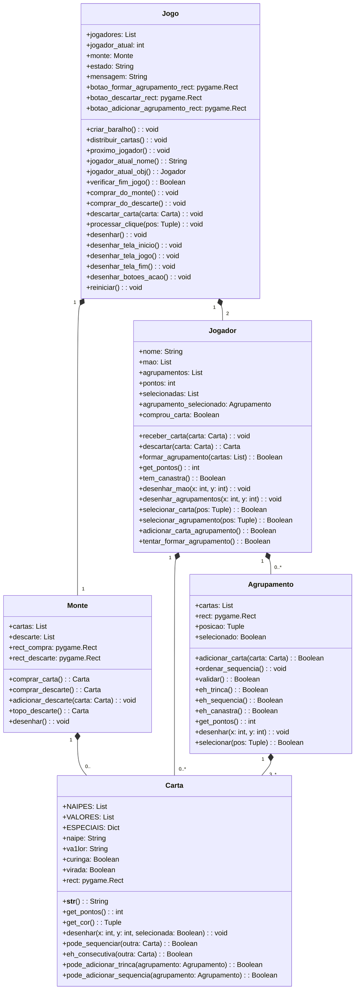

# Buraco Simplificado - Jogo de Cartas em Python com Pygame

Este projeto implementa uma versão simplificada do jogo de cartas Buraco (estilo Canastra) usando Python e Pygame. O jogo segue as regras básicas do Buraco com algumas simplificações para tornar a implementação mais direta, mantendo a essência do jogo original.

## Funcionalidades Principais

-   **Dois jogadores** alternando turnos
    
-   **Sistema completo de cartas** com valores, naipes e curingas
    
-   **Formação de agrupamentos**:
    
    -   Trincas (3+ cartas do mesmo valor)
        
    -   Sequências (3+ cartas consecutivas do mesmo naipe)
        
    -   Canastras (agrupamentos com 7+ cartas)
        
-   **Sistema de pontuação** baseado nas regras do Buraco
    
-   **Interface gráfica intuitiva** com Pygame
    
-   **Regras implementadas**:
    
    -   Compra obrigatória antes do descarte
        
    -   Tratamento especial para cartas "2" (podem ser usadas como normais ou curingas)
        
    -   Validação de jogadas

## Como Jogar

1.  **Início do jogo**:
    
    -   Cada jogador recebe 11 cartas
        
    -   Uma carta é virada para iniciar o descarte
        
2.  **Durante o jogo**:
    
    -   **Compre uma carta**: clique no monte de compra ou na pilha de descarte
        
    -   **Forme agrupamentos**:
        
        -   Selecione 3+ cartas válidas e clique em "Formar Novo Agrupamento"
            
        -   Para adicionar a um agrupamento existente, selecione-o e depois selecione as cartas para adicionar
            
    -   **Descartar**: selecione uma carta e clique em "Descartar" (após ter comprado)
        
3.  **Fim do jogo**:
    
    -   O jogo termina quando um jogador fica sem cartas na mão e tem pelo menos uma canastra
        
    -   A pontuação é calculada baseada nos agrupamentos formados e cartas restantes
        

## Estrutura do Código

O projeto está organizado em classes principais:

-   `Carta`: Representa uma carta individual com valor, naipe e propriedades
    
-   `Agrupamento`: Gerencia conjuntos de cartas (trincas, sequências)
    
-   `Jogador`: Controla a mão do jogador e seus agrupamentos
    
-   `Monte`: Gerencia o monte de compra e a pilha de descarte
    
-   `Jogo`: Classe principal que orquestra a lógica do jogo
    

## Regras Implementadas

1.  **Cartas**:
    
    -   Valores: A, 2-10, J, Q, K
        
    -   Naipes: ♠, ♥, ♦, ♣
        
    -   Curingas: 🃏 (verdadeiro) e '2' (funciona como curinga em sequências)
        
2.  **Agrupamentos válidos**:
    
    -   **Trinca**: 3+ cartas do mesmo valor (incluindo trincas de '2's)
        
    -   **Sequência**: 3+ cartas consecutivas do mesmo naipe (com possibilidade de usar curingas)
        
    -   **Canastra**: Agrupamento com 7+ cartas (bonus de pontos)
        
3.  **Pontuação**:
    
    -   Curinga: 20 pontos
        
    -   Ás: 15 pontos
        
    -   2, 8, 9, 10, J, Q, K: 10 pontos
        
    -   3-7: 5 pontos
        
    -   Bônus de canastra: 100 (com curinga) ou 200 (sem curinga) pontos
      

## Diagrama UML
